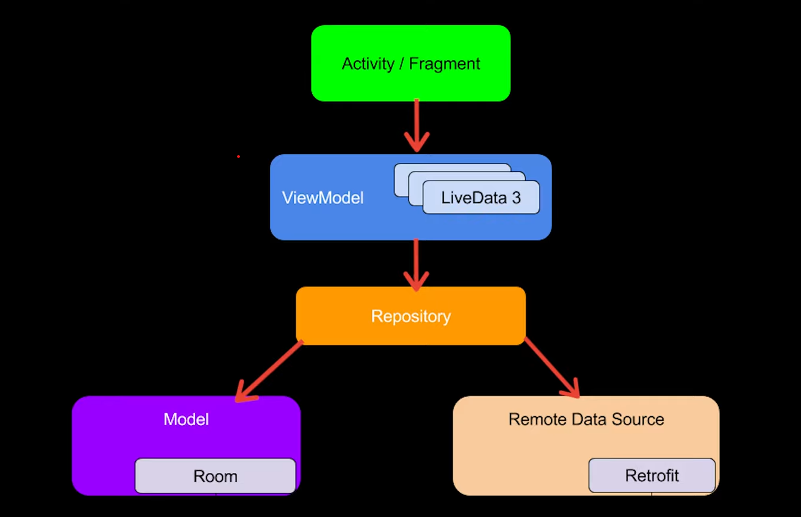

# mvvmShopping

    

**Author:** [Shivdatt Jangam](https://www.linkedin.com/in/shivdatt-jangam-96b814254/)

Features:
- MWM Architectural Design Pattern
- Room Persistence Library
- Kotlin Coroutines
- Practiced Dependency Injection with Kodein
- Added Swipe to delete Gesture

Model :

    

Great Help:
[Philip Lackner](https://www.youtube.com/@PhilippLackner)
